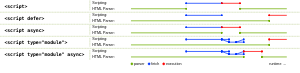

# PRACTICA 2 DWEC

## ENUNCIADO 1.

**<h2>1. Ventajas de incorporar el script desde un fichero externo frente a hacerlo en línea (código javascript directamente en el fichero HTML)</h2>**


    <span style="color:orange">Las ventajas son entre otras, los ficheros quedan más estilizados aparte de leerse más claramente, a su vez puede editarse con más facilidad estando separados.
    Esto es un ejemplo de codigo javascript externo del html</span>.

```js
// my-script.js
document.addEventListener("DOMContentLoaded", function() {
    // this function runs when the DOM is ready, i.e. when the document has been parsed
    document.getElementById("user-greeting").textContent = "Welcome back, Bart";
});
```

.

**<h2>2. Atributos de la etiqueta script</h2>**
<span style="color:red">src</span> — Dirección del recurso.
<span style="color:red">type </span>— tipo de script
<span style="color:red">nomodule</span> — previene la ejecución cuando tiene modulos.
<span style="color:red">async</span> — Ejecuta el script cuando pueda.
<span style="color:red">defer</span> — Difiere la ejecución del script
<span style="color:red">crossorigin</span> — como el elemento maneja peticiones crossorigin
<span style="color:red">integrity </span>. Contiene información de metadatos usada por el navegador para verificar el recurso captado fue entregado libre de manipulación inesperada.
<span style="color:red">blocking </span>.
<span style="color:red">text </span>-- Establece el contenido del elemento.

.

**<h2>3. Atributos por defecto.</h2>**

<span style="color:red">src</span> — Dirección del recurso.
<span style="color:red">type </span>— tipo de script.
<span style="color:red">charset </span>— Especifica la codificación del archivo javascript externo.

.

**<h2>4. Atributos Booleanos.</h2>**

 <span style="color:orange">Un atributo booleano es un atributo que puede estar activado o desactivado. Si el atributo está presente se tendrá en cuenta y si no está no. 
 Los atributos booleanos son async y defer e indican como debería ser evaluado el script.
 El atributo nomodule también es un atributo booleano.
 </span>




.


**<h2> 5. Sitio recomendado para colocar la etiqueta script.</h2>**

Lo más normal es colocar los scripts Javascript justo antes del cierre de la etiqueta body

```js
  [... contenido de la página ...]
  <script src="mis-scripts.js"></script>
</body>
```

Esto se hace así porque generalmente el Javascript tiene que ponerse en marcha cuando el navegador ha procesado el HTML. No sirve de mucho que el navegador procese el Javascript cuando el usario todavía no ha podido ver el contenido de la página. Además, el Javascript muchas veces debe operar con los elementos de la página, para modificarlos dinámicamente y ésto se tiene que hacer cuando los elementos han sido cargados por el navegador. Por todo ello se suele poner en la mayoría de los casos antes de cerrar la etiqueta body.


.


**<h2>6. Etiqueta noscript: utilidad, atributos y dónde colocar</h2>**

<span style="color:orange"> La etiqueta noscript se utiliza para definir un contenido alternativo en el documento web, cuando el navegador no soporta la ejecución de scripts, o bien cuando los mismos están desactivados en el navegador que recibe el documento.
La etiqueta se puede utilizar dentro del encabezado del documento o bien en el cuerpo del mismo, dependiendo de su posición se suele utilizar de forma distinta. Normalmente si se utiliza en el encabezado del documento, es decir dentro de la etiqueta head, suele afectar a etiquetas como link, style y meta, de forma que permite realizar la carga alternativa de estos elementos en caso de que el navegador no permite la ejecución de scripts. </span>

<span style="color:red"> Ejemplo</span> de noscript usado para cuando falla el script:

```js

<form action="calcSquare.php">
 <p>
  <label for=x>Number</label>:
  <input id="x" name="x" type="number">
 </p>
 <script>
  var x = document.getElementById('x');
  var output = document.createElement('p');
  output.textContent = 'Type a number; it will be squared right then!';
  x.form.appendChild(output);
  x.form.onsubmit = function () { return false; }
  x.oninput = function () {
    var v = x.valueAsNumber;
    output.textContent = v + ' squared is ' + v * v;
  };
 </script>
 <noscript>
  <input type=submit value="Calculate Square">
 </noscript>
</form>
 ```